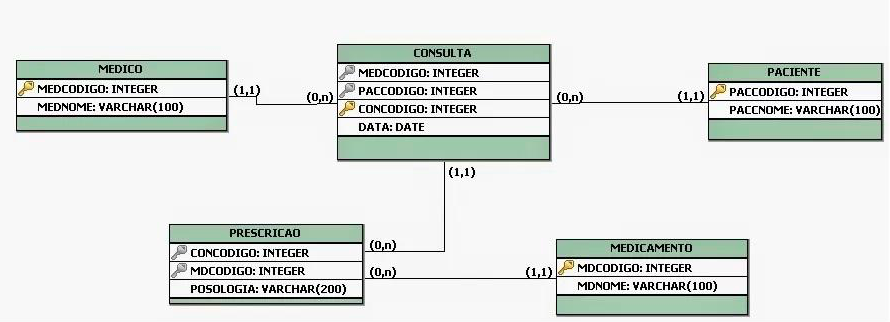

## 4. Projeto da Solução

**Etapa Do Projeto De Solução:**

-Análise e Pesquisa: Conduzir uma análise detalhada das necessidades da comunidade,
identificando demandas prioritárias. Realizar pesquisa de mercado local e global para entender
as oportunidades disponíveis.

-Planejamento Estratégico: Desenvolver um plano estratégico abrangente, contemplando a
arquitetura da plataforma, requisitos técnicos, estratégias de marketing e parcerias estratégicas.
Garantir escalabilidade e desempenho otimizado.

-Desenvolvimento da Plataforma: Implementar a plataforma com funcionalidades avançadas
de busca, correspondência eficiente e uma interface intuitiva. Incorporar tecnologias modernas
para garantir segurança e escalabilidade.

-Testes e Ajustes: Realizar testes rigorosos para garantir usabilidade, segurança e desempenho.
Ajustar com base nos feedbacks dos usuários, garantindo uma experiência aprimorada.
Monitoramento: Implementar sistemas de monitoramento para avaliar o desempenho da
plataforma, coletar feedbacks e realizar melhorias contínuas. Manter comunicação aberta com
os usuários.

**Resultados Esperados:**

-Uma plataforma eficiente que conecta com sucesso demandas por serviços a profissionais em
busca de oportunidades de emprego.

-Feedback positivo dos usuários destacando a utilidade, acessibilidade e benefícios sociais
proporcionados pela plataforma.

## 4.1. Arquitetura da solução

 
 **Diagrama de Arquitetura**:
 

**Diagrama da Solução**
O diagrama mostra uma solução composta por três módulos principais:

**Navegador:** Responsável por exibir a interface da plataforma aos usuários. O módulo do navegador é composto por páginas web que definem o conteúdo e a aparência da plataforma. As páginas web são escritas em HTML, CSS e JavaScript.

**Hospedagem:** Armazena e executa o código da plataforma. O módulo de hospedagem é responsável por armazenar e executar o código da plataforma. A plataforma pode ser hospedada em um servidor local ou em um provedor de hospedagem na nuvem.

**API:** Fornece acesso aos dados e funcionalidades da plataforma. O módulo de API fornece acesso aos dados e funcionalidades da plataforma. A API pode ser acessada por meio de chamadas HTTP ou por meio de uma biblioteca cliente.

**Tecnologias Utilizadas**
A solução utiliza as seguintes tecnologias:
**HTML:** Linguagem de marcação para definir a estrutura das páginas web.
**CSS:** Linguagem de estilo para definir a aparência das páginas web.
**JavaScript:** Linguagem de programação para adicionar interatividade às páginas web.
**Replit:** Plataforma online que permite desenvolver, testar e hospedar projetos em tempo real.
**Google Maps Platform:** Plataforma que fornece APIs para integrar mapas e outros dados geográficos em aplicativos.
**Google My Business:** Plataforma que permite gerenciar informações de negócios online.
 

### 4.2. Protótipos de telas

Tela Principal

Tela Sobre Serviços

Tela Cadastro

Tela Login

### 4.3. Modelo de dados

O desenvolvimento da solução proposta requer a existência de bases de dados que permitam efetuar os cadastros de dados e controles associados aos processos identificados, assim como recuperações.
Utilizando a notação do DER (Diagrama Entidade e Relacionamento), elaborem um modelo, na ferramenta visual indicada na disciplina, que contemple todas as entidades e atributos associados às atividades dos processos identificados. Deve ser gerado um único DER que suporte todos os processos escolhidos, visando, assim, uma base de dados integrada. O modelo deve contemplar, também, o controle de acesso de usuários (partes interessadas dos processos) de acordo com os papéis definidos nos modelos do processo de negócio.
_Apresente o modelo de dados por meio de um modelo relacional que contemple todos os conceitos e atributos apresentados na modelagem dos processos._

#### 4.3.1 Modelo ER

Entidades: 

Cliente 

Profissional 

Serviço 

 

Atributos: 

Cliente: ID_Cliente (PK), Nome, Email, Telefone, CPF 

Profissional: ID_Profissional (PK), Nome, Especialidade, Email, CPF 

Serviço: ID_Serviço (PK), Nome, Descrição, Preço 

  

Relacionamentos: 

Cliente compra Produto (M:N) 

Profissional realiza Serviço (M:N) 

#### 4.3.2 Esquema Relacional

O Esquema Relacional corresponde à representação dos dados em tabelas juntamente com as restrições de integridade e chave primária.
 
As referências abaixo irão auxiliá-lo na geração do artefato “Esquema Relacional”.

> - [Criando um modelo relacional - Documentação da IBM](https://www.ibm.com/docs/pt-br/cognos-analytics/10.2.2?topic=designer-creating-relational-model)

---

#### 4.3.3 Modelo Físico

Entregar um arquivo banco.sql contendo os scripts de criação das tabelas do banco de dados. Este arquivo deverá ser incluído dentro da pasta src\bd.

### 4.4. Tecnologias
Para a implementação do projeto em questão, estão sendo adotadas diversas tecnologias e ferramentas de ponta, visando proporcionar uma experiência robusta e moderna. A seleção criteriosa dessas tecnologias tem como objetivo otimizar o processo de desenvolvimento e oferecer uma solução eficiente aos usuários finais. 

A escolha central do ambiente de desenvolvimento recai sobre o Visual Studio, uma IDE (Integrated Development Environment) de destaque no mercado, reconhecida por sua versatilidade e suporte abrangente a várias linguagens de programação. Neste contexto específico, o Visual Studio é empregado para a programação web, fazendo uso de sua interface intuitiva e suas capacidades de depuração avançadas, as quais aceleram significativamente o ciclo de desenvolvimento. 

 Adicionalmente, incorpora-se o Bootstrap, um framework front-end que facilita a criação de interfaces web responsivas e esteticamente agradáveis. O Bootstrap oferece um conjunto de estilos predefinidos e componentes reutilizáveis que aprimoram a consistência visual e a experiência do usuário em diversos dispositivos. 

As IDE’s  assumem uma função crucial no fluxo de trabalho, proporcionando ferramentas poderosas para a edição de código, gerenciamento de projetos e depuração eficiente. A escolha de uma IDE eficaz é fundamental para a produtividade e qualidade do código, sendo empregada uma integrada ao Visual Studio para garantir um ambiente de desenvolvimento integrado e eficaz. 

Além disso, destaca-se a utilização do Javascript como componente essencial do projeto. Esta linguagem de programação do lado do cliente oferece dinamismo e interatividade às páginas web, permitindo a criação de interfaces ricas e responsivas. 

Ao combinar essas tecnologias, o projeto busca atender não apenas aos requisitos funcionais, mas também proporcionar uma experiência de usuário envolvente e moderna. A sinergia entre Visual Studio, Bootstrap, IDEs e Javascript cria uma base sólida para o desenvolvimento web eficiente e eficaz. 

